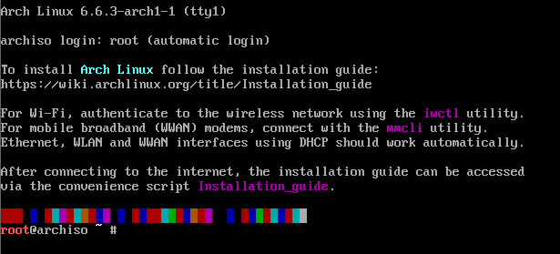
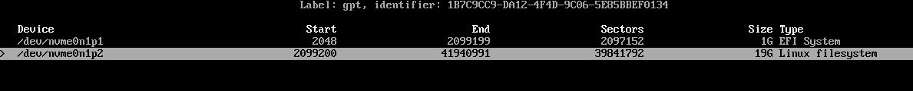
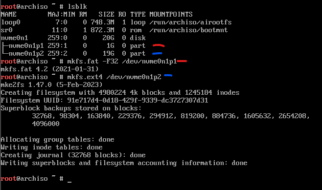
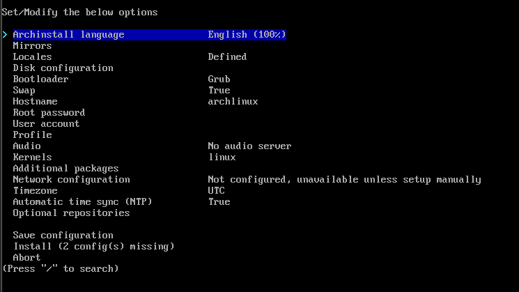
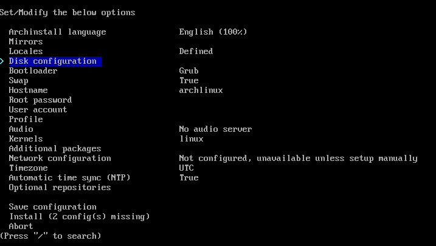
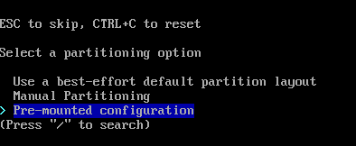
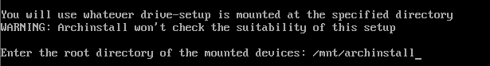
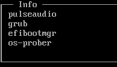

# GUIDE-INSTALL-ARCH

Welcome to the GUIDE-INSTALL-ARCH repository! This repository provides a comprehensive guide on how to install Arch Linux on your system. Whether you are a beginner or an experienced user, this guide will walk you through the installation process step by step, ensuring a successful installation.

## Table of Contents

- [Prerequisites](#prerequisites)
- [Installation Steps](#installation-steps)

## Prerequisites

Before you begin the installation, make sure you have the following prerequisites:

- A blank USB drive with a minimum capacity of 4GB
- A computer with UEFI or BIOS firmware
- Basic knowledge of the command line interface
- Do a basic free space check on your disk with `lsblk` and make sure you have at least 20GB of free space

## Installation Steps

The installation process consists of the following steps:

1. Preparing the USB drive
2. Booting into the Arch Linux installer
3. If you are here on the image it's ok ! 
4. Partitioning the disk with `cfdisk` minimum 2 partitions (EFI 1gb and root) 
5. Formatting the partitions with this commands (check your EFI and root partition with `lsblk`):
    - `mkfs.fat -F32 /dev/nvm0n1p1`
    - `mkfs.ext4 /dev/nvm0n1p2`
    
    This is the result 
6. Create Partition for archinstall command:
    - `mount --mkdir /dev/nvm0n1p2 /mnt/archinstall`
    - `mount --mkdir /dev/nvm0n1p1 /mnt/archinstall/boot`
    - `pacman -Sy archlinux-keyring`
7. Run `archinstall` command normally you have this: 

8. In first change DiskConfiguration to this:   

8. Configuring the system:
    - Check the bootloader is set on `systemd-boot`
    - Set root Password
    - Create a new user
    - Add Network solution, Use `NetworkManager` for Desktop Environment
    - You can set Profile for instaling Desktop Environment
    - Don't touch Audio Option, it can crash your system
    - Add Additional Packages !
    
    
9. After the script is finished, enter yes for chrooting into the new system

10. After chrooting, run the following commands we need to reinstall the grub:
    - `bootctl remove` (remove the old grub)
    - `grub-install --target=x86_64-efi --efi-directory=/boot --bootloader-id=arch` (install the new grub)
    - `grub-mkconfig -o /boot/grub/grub.cfg` (generate the grub config file)
    - `nano /etc/default/grub` (edit the grub config file)
    - `GRUB_DISABLE_OS_PROBER=false` (add this line to the grub config file)
    - Do exit command and reboot your system
    - After rebooting, you should see the grub menu, select Arch Linux and press enter
    - After booting into the system, login with your username and password
    - Run `sudo mount --mkdir /dev/nvme0n1p1 /mnt/win` (mount the windows partition, check with `lsblk` if you are not sure what partition is)
    - Run `grub-mkconfig -o /boot/grub/grub.cfg` (generate the grub config file)
    - It's done ! normaly you have now windows and archlinux on your grub menu !